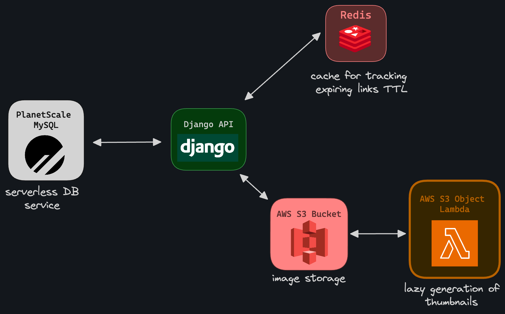

# ImagifyAPI

An API service built with Django REST Framework allowing users to upload, view and manage images based on their subscription tier. Users could belong to different tiers each having distinct privileges regarding image upload and access.

## Features

- **Image Upload**: Users can upload images via HTTP request.
- **Image Listing**: Users can list all their images they've uploaded.
- **Tier-based Access**: Provides different access levels based on subscription tier:
  - Basic: Thumbnail (200px)
  - Premium: Thumbnails (200px & 400px)
  - Enterprise: Thumbnails + Original Image + Expiring link to original image
- **Custom Tier Management**: Admins can create custom tiers with configurable thumbnail sizes, link to original file, and expiring links generation.
- **Expiring Links**: Enterprise users can generate expiring links to their images.

## System Design

The architecture of the ImagifyAPI is structured around robust and scalable cloud services. At the core of the system lies the **Django REST Framework**, providing a solid foundation for handling HTTP requests efficiently. Images uploaded by users are securely stored in **AWS S3** buckets, which are known for their durability and accessibility. To manage the database operations, a serverless **Planetscale MySQL DB** is employed, which autonomously handles scaling, ensuring optimal performance at all times.

For tracking the time-to-live (TTL) of expring links, a cloud-based **Redis** service is utilized.

The thumbnail generation is managed in a lazy manner utilizing **AWS Lambda** functions, which are triggered upon access. This lazy loading approach ensures that thumbnails are generated only when necessary, contributing to both cost-efficiency and enhanced speed.

The diagram below provides a visual representation of how these cloud services are interconnected within the system, showcasing a high-level overview of the system's design.



## Demo

Deployed to Vercel:
https://hexocean-django.vercel.app/

## How it Works

### Authentication

The app utilizes Django Rest Framework's `BrowsableAPIRenderer` for user authentication. Users can log in via https://hexocean-django.vercel.app/api-auth/login. User accounts can be created and managed through the Django admin UI, ensuring streamlined administration of access and permissions within the system.

### Tier System

The user tier system within the ImagifyAPI is elegantly built upon the inherent permissions and groups feature of Django. There are four key predefined permissions that control the different levels of access and functionality across the system:

- `can_generate_expiring_link`: Allows generating expiring links to images.
- `can_access_original_image`: Grants access to the originally uploaded images.
- `thumbnail:200`: Permits access to a 200px thumbnail of the images.
- `thumbnail:400`: Allows access to a 400px thumbnail of the images.

In addition to these permissions, three predefined groups representing the user tiers have been established: **BasicTierUsers**, **PremiumTierUsers**, and **EnterpriseTierUsers**. Each of these groups comes bundled with relevant permissions out-of-the-box to cater to the distinct access levels associated with each tier.

- **BasicTierUsers**: Members have access to `thumbnail:200` permission.
- **PremiumTierUsers**: Members have access to `thumbnail:200` and `thumbnail:400` permissions.
- **EnterpriseTierUsers**: Members have access to `thumbnail:200`, `thumbnail:400`, `can_access_original_image`, and `can_generate_expiring_link` permissions.

For further customization and to meet diverse access control needs, arbitrary tiers can be effortlessly crafted using the Django admin UI. This is achieved by creating a custom group and assigning the adequate permissions to define the new tier.

Moreover, to enable access to arbitrary thumbnail sizes in custom tiers, the system supports the creation of custom thumbnail permissions. The codename for these custom thumbnail permissions must follow the format `thumbnail:{height in px}` to ensure proper functionality.

## Areas for Improvement

The current system, mostly based on cloud services, can easily scale up by adding resources to meet higher demands and maintain good performance. Yet, there's room to explore ways to further improve performance.

A potential bottleneck might reside in the AWS Lambda function, which utilizes a Python runtime for image resizing tasks. While Python is robust and developer-friendly, it may not be the fastest language for image processing. Exploring a faster language runtime such as Go or Rust could lead to quicker image generation, hence improving the overall response time for thumbnail access.

It's important to note that the lazy thumbnail generation at access time doesn't slow down the entire system or affect other functionalities. However, speeding up this process could make the user experience smoother, especially when there are many users or a large number of image access requests.

Further optimizations could also be achieved by examining the caching strategies, database indexing, and potentially offloading more tasks to background processes, ensuring the core functionalities remain swift and responsive.

## Running Locally

To run the project on your local machine, it's essential to first set up the environment variables which are crucial for the proper operation of the system. Create a `.env` file in the root directory of the project and fill it with the environment variables listed in `.env.development` file. Once the `.env` file is set up, follow the steps below:

```bash
python -m venv venv

source venv/bin/activate

python manage.py runserver
```

## Testing

```bash
python manage.py test
```

## License

This project is open source and available under the MIT License.
